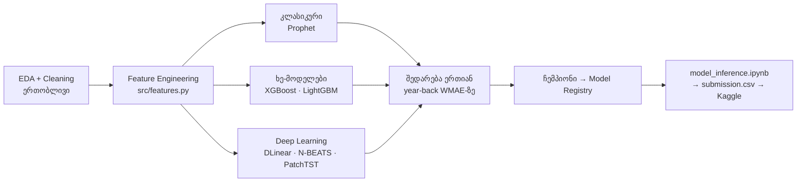
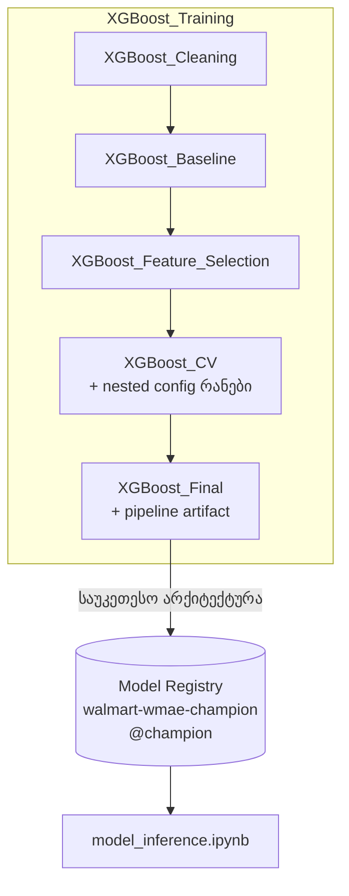

# Walmart Recruiting — Store Sales Forecasting

**ML ფინალური პროექტი** · Kaggle შეჯიბრი: [walmart-recruiting-store-sales-forecasting](https://www.kaggle.com/competitions/walmart-recruiting-store-sales-forecasting/)

**გუნდი:** ლუკა სანარსკი, გიორგი გელაშვილი · **MLflow:** _https://dagshub.com/lsana22/ML-Final-Walmart-Recruiting.mlflow_

---

## 1. ამოცანა

45 Walmart მაღაზია × ~81 დეპარტამენტი ≈ **3,331 კვირეული დროის მწკრივი**. Train: 2010-02-05 →
2012-10-26 (143 კვირა, 421,570 რიგი). უნდა ვიპროგნოზოთ მომდევნო **39 კვირა** (2012-11-02 →
2013-07-26, 115,064 რიგი) თითოეული (Store, Dept, Date) სამეულისთვის.

**მეტრიკა — WMAE:**

$$WMAE = \frac{1}{\sum w_i}\sum_i w_i\,|y_i - \hat{y}_i|, \qquad w_i = \begin{cases}5 & \text{სადღესასწაულო კვირა}\\1 & \text{სხვა}\end{cases}$$

ოთხი დღესასწაული (Super Bowl, Labor Day, Thanksgiving, Christmas) კვირების მხოლოდ 7%-ია,
მაგრამ მეტრიკის ~27%-ს იწონის — **მთელი პროექტი ამ ფაქტის გარშემოა აწყობილი** (ვალიდაციის
სქემა, ტრენინგის წონები, ფიჩერები).

## 2. რეპოზიტორიის სტრუქტურა

```
├── model_experiment_XGBoost.ipynb     ← ხე-მოდელები + პროექტის მთავარი EDA
├── model_experiment_LightGBM.ipynb
├── model_experiment_Prophet.ipynb     ← კლასიკური მოდელი (store-დონე + დაშლა)
├── model_experiment_DLinear.ipynb     ← DL: ჩვენივე იმპლემენტაცია PyTorch-ზე
├── model_experiment_NBEATS.ipynb      ← DL: ჩვენივე იმპლემენტაცია PyTorch-ზე
├── model_experiment_PatchTST.ipynb    ← DL: neuralforecast
├── model_inference.ipynb              ← ჩემპიონი Registry-დან → submission.csv
├── src/                               ← საზიარო კოდი (ყველა notebook იყენებს)
│   ├── data.py          — CSV-ების პოვნა/ჩატვირთვა (ლოკალური/Colab/Kaggle layout-ები)
│   ├── features.py      — WalmartFeatureBuilder: sklearn transformer (raw → ფიჩერები)
│   ├── metrics.py       — WMAE + holiday წონები
│   ├── validation.py    — დროითი split-ები (year-back, expanding folds)
│   ├── tracking.py      — MLflow კონფიგი, Registry-ის სახელი
│   └── dl.py            — DLinear/N-BEATS from scratch + windowing + pyfunc wrapper
├── scripts/make_diagrams.py           ← არასავალდებულო დიაგრამები (ლოკალურად)
└── data/                              ← Kaggle CSV-ები
```

## 3. სამუშაო პროცესი



## 4. მონაცემები — მთავარი დაკვირვებები (EDA)

EDA-ს გრაფიკები `model_experiment_XGBoost.ipynb`-შია; გადაწყვეტილებებზე გავლენის მქონე ფაქტები:

| დაკვირვება | შედეგი დიზაინზე |
|---|---|
| Thanksgiving/Christmas-ზე გაყიდვების მკვეთრი პიკები, პიკი ხშირად დღესასწაულის **წინა** კვირებშია | holiday-distance ფიჩერები (`wk_to_christmas` და სხვ.), Prophet-ის holiday-ფანჯრები |
| მწკრივების მასშტაბები ~3 რიგით განსხვავდება | per-series სკეილინგი DL-ში; per-series სტატისტიკები ფიჩერებად ხეებში |
| MarkDown1–5 train-ში მხოლოდ 2011-11-დან არსებობს, test-ში — ყველგან | NaN→0 + `has_markdown` flag (განვასხვავოთ „აქცია არ იყო" და „მონაცემი არ გროვდებოდა") |
| 1,285 რიგი უარყოფითი გაყიდვებით | ვტოვებთ — რეალური დაბრუნებებია, მეტრიკა სიმეტრიულია |
| მწკრივების ნაწილს კვირები აკლია; test-ში 36 უცნობი (Store, Dept) წყვილია | DL: 0+mask; ხეები: fallback-სტატისტიკები + `is_new_series` flag |
| CPI/Unemployment test-ის ბოლო თვეებში NaN-ია | per-store forward-fill |

## 5. მეთოდოლოგია

### 5.1 Pipeline-კონტრაქტი

კურსის მოთხოვნა: შენახული მოდელი **დაუმუშავებელ** test set-ზე უნდა ეშვებოდეს. ამიტომ feature
engineering ცალკე სკრიპტი კი არა, **sklearn transformer-ია** (`src/features.py`), რომელიც fit-ისას
თავის შიგნით ინახავს side-ცხრილებს (features.csv, stores.csv), გაყიდვების ისტორიას (lag-ებისთვის)
და per-series სტატისტიკებს. `Pipeline([features, model])` ერთ ობიექტად ილოგება MLflow-ში —
inference-ის notebook-ში აღარანაირი პრეპროცესინგ-კოდი აღარ არსებობს.

ფიჩერების ლოგიკიდან აღსანიშნავია **lag_52**: test-ის ჰორიზონტი 39 კვირაა < 52, ამიტომ
„წლის წინანდელი გაყიდვები" ყველა test-რიგისთვის ისტორიიდან პირდაპირ იშლება — რეკურსია და
leakage გამორიცხულია (test-რიგების 98.2%-ს რეალური lag_52 აქვს).

### 5.2 ვალიდაცია — year-back split

შემთხვევითი K-fold აქ **არასწორია** (ერთი მწკრივის რიგები train-შიც და valid-შიც მოხვდებოდა).
ყველა მოდელი ფასდება ერთსა და იმავე **year-back split-ზე**: train ≤ 2011-10-28, valid =
მომდევნო 39 კვირა — Kaggle-ის setup-ის ზუსტი ასლი ერთი წლით ადრე, Thanksgiving/Christmas/Super
Bowl-ის ჩათვლით. „ბოლო N კვირის" holdout Christmas-ს ვერ დაინახავდა და ×5-წონიან მეტრიკაზე
მოგვატყუებდა. ჰიპერპარამეტრებისთვის დამატებით — 3 expanding-window fold.

### 5.3 მეტრიკის გასწორება ტრენინგში

WMAE-ს არ ვაფასებთ მხოლოდ ბოლოში — ვასწავლით მასზე:
- ხე-მოდელები: `objective = MAE(L1)` + `sample_weight = 5` სადღესასწაულო რიგებზე → ტრენინგის
  loss ≡ WMAE;
- ჩვენი DL მოდელები: masked, holiday-weighted MAE loss (`src/dl.py`) — ისევ ≡ WMAE;
- PatchTST (ბიბლიოთეკა): მხოლოდ MAE — დაფიქსირებული trade-off (იხ. §6.6).

### 5.4 DL მოდელების საერთო მონაცემი (global model)

DLinear, N-BEATS და PatchTST ვწვრთნით როგორც **ერთ გლობალურ ქსელს ყველა მწკრივზე** — ლოგიკა
`src/dl.py`-შია, დიზაინის გადაწყვეტილებები:

| გადაწყვეტილება | რატომ |
|---|---|
| ერთი გლობალური ქსელი ყველა მწკრივზე | ცალკე მწკრივი 143 წერტილია — ქსელისთვის ცოტაა; 3.3k მწკრივის window-ები ერთად ~165k სამპლს იძლევა |
| სრული W-FRI გრიდი, გამოტოვებული კვირა = 0 + **mask** | window-ებს ფიქსირებული ზომა სჭირდება; mask-ით ეს კვირები loss-ში არ ითვლება |
| per-series **mean-abs სკეილინგი** | მასშტაბები ~100×-ჯერ განსხვავდება — უსკეილინგოდ დიდი მწკრივები მთელ გრადიენტს წაიღებდნენ |
| loss = mask × holiday-weight × MAE | ეს **ზუსტად WMAE-ა** — ქსელი პირდაპირ ლიდერბორდის მეტრიკას ამცირებს |
| direct multi-horizon (ერთბაშად 39 კვირა) | რეკურსიული 1-ნაბიჯიანი პროგნოზი 39 ნაბიჯზე შეცდომას აგროვებს |

**მონაცემის სიმცირე year-back ფაზაში:** dev-პერიოდი 91 კვირაა, window-ს კი L+H = 52+39 = 91
სჭირდება → თითო მწკრივზე ზუსტად 1 window (~3.3k სამპლი). ამას ვჯერდებით, რადგან L=52-ზე
ნაკლები input წლის-წინანდელ Christmas-ს ვერ დაინახავდა; საბოლოო ტრენინგი კი სრულ ისტორიაზე
~53 window/მწკრივს (~165k სამპლს) იყენებს.

## 6. მოდელები

| Notebook | არქიტექტურა | მიდგომა | რატომ ვცდით |
|---|---|---|---|
| Prophet | კლასიკური (GAM) | store-დონე + დაშლა, holiday-ფანჯრები | დღესასწაულების პირდაპირი მოდელირება ცალკე კოეფიციენტებით |
| XGBoost | Gradient Boosting | გლობალური ცხრილური მოდელი სრული ფიჩერებით | ამ ტიპის ამოცანების ინდუსტრიული სტანდარტი |
| LightGBM | Gradient Boosting | იგივე + objective-ების შედარება (l1/l2/huber) | leaf-wise ზრდა, სისწრაფე, native L1 |
| DLinear | DL (წრფივი) | **ჩვენი იმპლემენტაცია**, დეკომპოზიცია + 2 წრფივი ფენა | DL ბლოკის baseline — „ღირს თუ არა სირთულე" |
| N-BEATS | DL (FC) | **ჩვენი იმპლემენტაცია**, generic ვარიანტი | doubly-residual დეკომპოზიცია, M4-ის გამარჯვებული იდეა |
| PatchTST | DL (Transformer) | neuralforecast | attention პაჩებზე, channel-independent |

ქვემოთ თითოეული არქიტექტურის თეორია და ჩვენი მიდგომა (ეს ახსნები ადრე notebook-ებში იყო;
გადმოვიტანეთ აქ, notebook-ები კი კოდზეა დაყვანილი).

### 6.1 Prophet

დეკომპოზიციური GAM: $y(t) = g(t) + s(t) + h(t) + \varepsilon_t$ —
- $g(t)$ ტრენდი (piecewise-linear, ავტომატური changepoints),
- $s(t)$ სეზონურობა ფურიეს მწკრივებად,
- $h(t)$ **დღესასწაულები ცალკე კოეფიციენტებით და ფანჯრებით** — ჩვენს ამოცანაზე მთავარი
  უპირატესობა (markdown-ეფექტი დღესასწაულამდე იწყება, ამიტომ `lower_window` უარყოფითია).

ფიტი MAP-ოპტიმიზაციით, წამებში. მოდელი უნივარიაციულია და per-series ფიტდება, ამიტომ ვაფიტებთ
45 store-დონის ჯამურ მწკრივზე და პროგნოზს დეპარტამენტებზე ვშლით ისტორიული წილებით.

### 6.2 XGBoost

**გლობალური ცხრილური მოდელი:** ყველა მწკრივის pooled ცხრილი, სადაც მწკრივის „იდენტობა" ფიჩერებია
(per-series mean/std, lag_52). ცალკე მწკრივი მოკლეა, მაგრამ ერთად ბევრი სამპლია — ამ ტიპის retail
ამოცანების ინდუსტრიული სტანდარტი. `objective = reg:absoluteerror` (MAE) პირდაპირ ჩვენს მეტრიკას
შეესაბამება, ×5 holiday-წონა `sample_weight`-ით → ტრენინგის loss = WMAE.

### 6.3 LightGBM

მეორე ხე-არქიტექტურა შესადარებლად:
- **leaf-wise ზრდა** (XGBoost-ის level-wise-ის ნაცვლად) — ხშირად უფრო ზუსტი, თუმცა overfit-ისკენ
  მიდრეკილი (`num_leaves`/`min_child_samples` აკონტროლებს);
- ჰისტოგრამული split-ები + სისწრაფე (CPU-ზეც წუთებში);
- native `l1` objective. **ვცდით l1/l2/huber-ს** — ველოდებით რომ l1 მოიგებს (მეტრიკის წყვილია).

### 6.4 DLinear (ჩვენი იმპლემენტაცია)

Zeng et al. 2022: long-horizon-ზე მძიმე Transformer-ებს ხშირად ჯობნის მარტივი მოდელი — input
window დაშალე **ტრენდად** (მოძრავი საშუალო) + **სეზონურ ნაშთად**, თითოეულს **ერთი წრფივი ფენა**
(L→H) და შეკრიბე. სულ ~4k პარამეტრი. Walmart-ის გაყიდვებში სიგნალის დიდი ნაწილი ტრენდი+წლიური
სეზონურობაა, ამიტომ ეს „ნასწავლი სეზონური ნაივი" ძლიერი baseline-ია DL ბლოკისთვის.

### 6.5 N-BEATS (ჩვენი იმპლემენტაცია)

Oreshkin et al. 2020: fully-connected ბლოკები ორი გამოსავლით — **backcast** (რას ხსნის ბლოკი
input-ში) და **forecast** (რას უმატებს პროგნოზს). შემდეგ ბლოკს გადაეცემა ნაშთი `x − backcast`
(*doubly-residual stacking*): ყოველი ბლოკი სწავლობს იმას, რაც წინებმა ვერ ახსნეს; საბოლოო პროგნოზი
ბლოკების ჯამია. ვიყენებთ **generic** ვარიანტს (ქაღალდში generic ≥ interpretable სიზუსტით).

### 6.6 PatchTST

Nie et al. 2023: Transformer დროის მწკრივზე ორ პრობლემას აგვარებს — (1) **patching**: მწკრივი
გადაფარვად პაჩებად იჭრება (8 კვირა, ნაბიჯი 4), თითო პაჩი ტოკენია → attention ხედავს ლოკალურ
*ფორმებს*, sequence მოკლდება; (2) **channel independence**: ყველა მწკრივი ერთსა და იმავე ქსელში
ცალ-ცალკე გადის. **იმპლემენტაცია `neuralforecast`-ია** (scratch-ად წერა multi-head attention-ის
გამო რისკიანია, პროექტის ფოკუსი კი შედარებაა). **Trade-off:** ბიბლიოთეკის loss-ს ×5 holiday-წონას
ვერ მივაწვდით — ვიყენებთ ჩვეულ MAE-ს (holiday-კვირები ისედაც მაღალი აბსოლუტური მნიშვნელობებია).


## 7. ექსპერიმენტების ლოგირება (MLflow)

კურსის მოთხოვნილი სტრუქტურა: **თითო არქიტექტურა = ცალკე experiment**, შიგნით run-ები
ეტაპების მიხედვით:



იგივე შაბლონი ყველა არქიტექტურაზე (`{Arch}_Preprocessing/Cleaning → {Arch}_CV → {Arch}_Final`).
ყოველი `{Arch}_Final` ლოგავს მოდელს **Pipeline-ად**; Registry-ში რეგისტრირდება მხოლოდ
საერთო-საუკეთესო (რეგისტრაციის cell თითო notebook-ის ბოლოშია, დროშით).

**Backend:**
- ლოკალურად: `sqlite:///mlflow.db` (default; file-store Registry-ს ვერ უჭერს მხარს). UI:
  `mlflow ui --backend-store-uri sqlite:///mlflow.db`
- გუნდურად/Colab-ზე (რეკომენდებული — Colab-ის დისკი ეფემერულია!): DagsHub —
  `MLFLOW_TRACKING_URI/USERNAME/PASSWORD` env ცვლადები notebook-ის გაშვებამდე.
